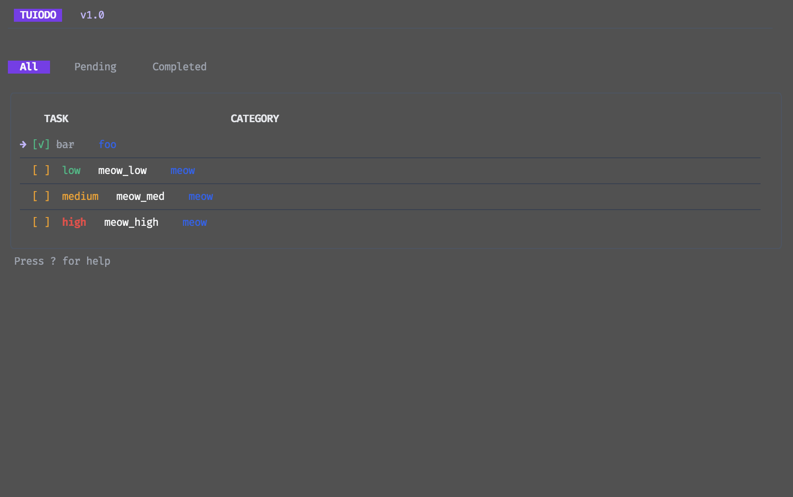
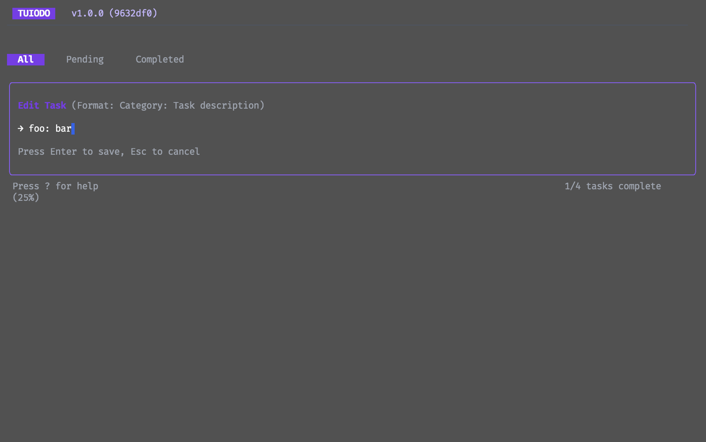
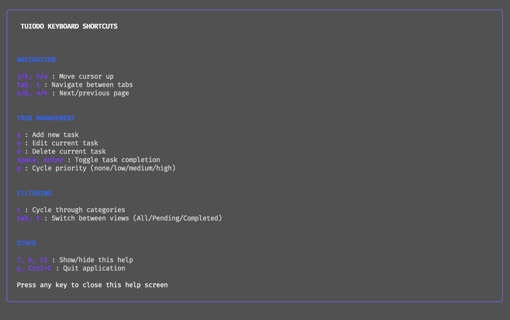
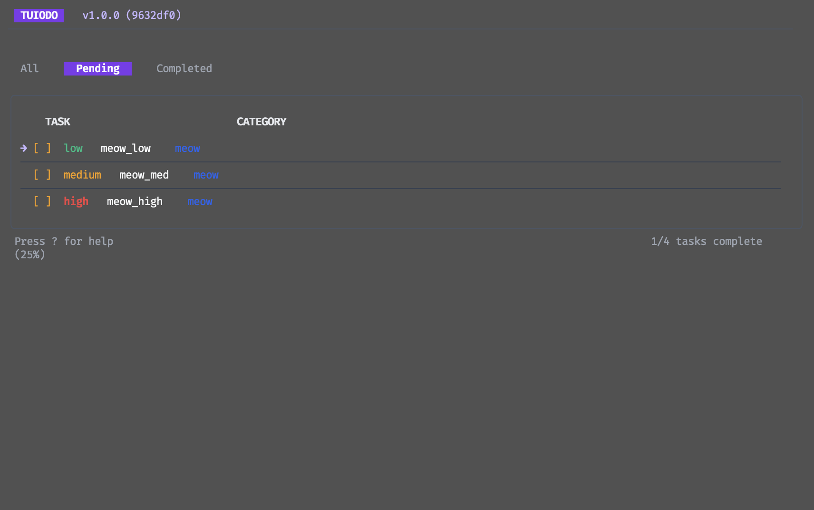

# 🪄 TUIODO - A Modern Terminal Task Manager

<p align="center">
  
  
  
</p>

<div align="center">
  
</div>

<p align="center">
  <b>A beautiful, lightning-fast terminal task manager with extensive customization.</b>
</p>

## ✨ Features

### 🌈 Core Features

- **Gorgeous Modern UI** with clean typography and visual hierarchy
- **Brilliant Colors** that automatically adapt to your terminal's capabilities
- **Mouse Support** with hover effects and click interactions (where supported)
- **Keyboard-Driven** workflow with intuitive, vim-inspired shortcuts
- **Instant Performance** with optimized rendering and caching

### 📋 Task Management

- **Priority Levels** (High/Medium/Low) with color coding
- **Category Organization** for grouping related tasks
- **Due Dates** with optional date formatting
- **Smart Filtering** by status, category, priority, or due date
- **Powerful Search** with instant results as you type
- **Task Dependencies** to create linked task workflows (coming soon)

### 📝 Content & Storage

- **Markdown Storage** in simple, human-readable format
- **Automatic Backups** with configurable options
- **Git Integration** for versioning your task list (coming soon)
- **Multi-device Sync** via configurable storage paths (share tasks via Dropbox, etc.)
- **Import/Export** to standard formats (coming soon)

### 🔧 Advanced Capabilities

- **Extensive Configuration** via YAML configuration files
- **Theme Support** with pre-built and custom themes
- **Custom Keybindings** to match your workflow
- **Command Palette** for quick access to all features (coming soon)
- **Plugin System** for extending functionality (coming soon)

## 📸 Screenshots

<div align="center">
  <table>
    <tr>
      <td>
        
        <p align="center"><i>Main Task View</i></p>
      </td>
      <td>
        
        <p align="center"><i>Task Editing</i></p>
      </td>
    </tr>
    <tr>
      <td>
        
        <p align="center"><i>Help Screen</i></p>
      </td>
      <td>
        
        <p align="center"><i>Category Filtering</i></p>
      </td>
    </tr>
  </table>
</div>

## 🚀 Installation

### Prerequisites

- Go 1.24+ (or use the pre-built binaries)
- A terminal with true color support recommended (iTerm2, Alacritty, Kitty, etc.)

### Via Homebrew (macOS)

```bash
# Install from the official tap
brew tap spmfte/tuiodo
brew install tuiodo
```

### Via AUR (Arch Linux)

```bash
# Using yay
yay -S tuiodo

# Using paru
paru -S tuiodo

# Manual installation from AUR
git clone https://aur.archlinux.org/tuiodo.git
cd tuiodo
makepkg -si
```

### Via Go Install

```bash
go install github.com/spmfte/tuiodo@latest
```

### From Source

```bash
# Clone the repository
git clone https://github.com/spmfte/tuiodo.git
cd tuiodo

# Build the project
go build

# Run it
./tuiodo
```

## 🎮 Quick Start

### Basic Usage

1. Launch TUIODO in your terminal: `tuiodo`
2. Add a new task: Press `a`
3. Toggle task completion: Press `space` or `enter`
4. Delete a task: Press `d`
5. Edit a task: Press `e`
6. Get help: Press `?`

### Task Format

When adding tasks, you can specify categories using the format:

```
Category: Task description
```

For example:

- "Work: Finish quarterly report"
- "Personal: Call mom about birthday plans"
- "Health: Schedule dentist appointment"

### Adding Priorities

Use the `p` key to cycle through priority levels for the selected task:

- `None → Low → Medium → High → None`

### Command-line Options

```bash
# Use a specific config file
tuiodo --config ~/.config/tuiodo/my-config.yaml

# Use a different storage file
tuiodo --storage ~/projects/work-tasks.md

# Configure items per page
tuiodo --tasks-per-page 15

# Create a default config file
tuiodo --create-default-config

# Print your current configuration
tuiodo --print-config
```

## ⌨️ Keyboard Controls

| Action              | Keys                                   |
| ------------------- | -------------------------------------- |
| **Navigation**      |                                        |
| Move cursor down    | <kbd>j</kbd> <kbd>↓</kbd>              |
| Move cursor up      | <kbd>k</kbd> <kbd>↑</kbd>              |
| Next page           | <kbd>n</kbd> <kbd>→</kbd> <kbd>l</kbd> |
| Previous page       | <kbd>b</kbd> <kbd>←</kbd> <kbd>h</kbd> |
| Switch tabs         | <kbd>tab</kbd> <kbd>t</kbd>            |
| **Task Management** |                                        |
| Add task            | <kbd>a</kbd>                           |
| Edit task           | <kbd>e</kbd>                           |
| Delete task         | <kbd>d</kbd>                           |
| Toggle completion   | <kbd>space</kbd> <kbd>enter</kbd>      |
| Cycle priority      | <kbd>p</kbd>                           |
| **Filtering**       |                                        |
| Cycle categories    | <kbd>c</kbd>                           |
| Show/hide help      | <kbd>?</kbd> <kbd>F1</kbd>             |
| Quit                | <kbd>q</kbd> <kbd>Ctrl+c</kbd>         |

## 🔧 Configuration

TUIODO supports extensive configuration through a YAML file located at `~/.config/tuiodo/tuiodo.yaml`.

### Configuration Locations

Configuration files are automatically loaded from the following locations (in order):

1. Custom path specified with `--config /path/to/config.yaml`
2. `~/.config/tuiodo/tuiodo.yaml` (primary location)
3. User config directory as reported by OS
4. Current directory `./tuiodo.yaml`

### Creating a Default Config File

To generate a default configuration file:

```bash
tuiodo --create-default-config
```

### Configuration Sections

The configuration file is divided into these main sections:

#### 1. General Settings

```yaml
general:
  default_category: "Uncategorized" # Default category for new tasks
  show_status_bar: true # Show status bar at bottom
  tasks_per_page: 10 # Number of tasks to show per page
  clear_status_after_seconds: 3 # Time before status messages disappear
```

#### 2. UI Settings

```yaml
ui:
  show_header: true # Show app header
  header_format: "TUIODO" # Header text
  show_categories: true # Show category labels
  show_priorities: true # Show priority indicators
  show_due_dates: true # Show due dates
  task_separator: "─" # Character used to separate tasks
  enable_tabs: true # Show tab bar
  enable_borders: true # Show container borders
  border_style: "rounded" # Border style (rounded, normal, double, thick, none)
  date_format: "2006-01-02" # Go date format
  cursor_indicator: "→ " # Cursor symbol
  checkbox_done: "[✓]" # Completed task checkbox
  checkbox_pending: "[ ]" # Pending task checkbox
```

#### 3. Color Settings

```yaml
colors:
  color_mode: "auto" # Color mode (auto, true_color, 256, 16, none)
  theme: "default" # Color theme (default, dark, light, custom)
  primary: "#7C3AED" # Primary color (purple)
  secondary: "#2563EB" # Secondary color (blue)
  tertiary: "#10B981" # Tertiary color (green)
  success: "#10B981" # Success color (green)
  warning: "#F59E0B" # Warning color (amber)
  error: "#EF4444" # Error color (red)
  text: "#F9FAFB" # Main text color
  text_dim: "#E5E7EB" # Dimmed text
  text_muted: "#9CA3AF" # Muted text
  highlight: "#C4B5FD" # Highlight color
  border: "#4B5563" # Border color
  border_focus: "#8B5CF6" # Focused border color
  subtle: "#374151" # Subtle color

  # Task priorities
  priority_high: "#EF4444" # High priority (red)
  priority_medium: "#F59E0B" # Medium priority (amber)
  priority_low: "#10B981" # Low priority (green)

  # Task status
  task_done: "#9CA3AF" # Completed task color
  task_pending: "#F9FAFB" # Pending task color

  # Custom category colors
  category_colors:
    Work: "#3B82F6" # Blue
    Personal: "#EC4899" # Pink
    Health: "#10B981" # Green
    Finance: "#6366F1" # Indigo
```

#### 4. Key Bindings

```yaml
keybindings:
  quit: ["q", "ctrl+c"]
  add_task: ["a"]
  edit_task: ["e"]
  delete_task: ["d"]
  toggle_task: ["enter", "space"]
  cycle_priority: ["p"]
  cycle_category: ["c"]
  cycle_tab: ["tab", "t"]
  next_page: ["right", "l", "n"]
  prev_page: ["left", "h", "b"]
  move_cursor_up: ["up", "k"]
  move_cursor_down: ["down", "j"]
  help: ["?", "F1"]
```

#### 5. Storage Settings

```yaml
storage:
  file_path: "TODO.md" # Path to task storage file
  backup_directory: "~/.config/tuiodo/backups" # Backup directory
  auto_save: true # Save automatically on changes
  backup_on_save: true # Create backups when saving
  max_backups: 5 # Maximum number of backups to keep
```

## 📝 Storage Format

Tasks are stored in a simple Markdown format that's human-readable and version-control friendly:

```markdown
## Work

- [ ] Prepare presentation @priority:high @due:2023-06-15
- [x] Send weekly report @priority:medium

## Personal

- [ ] Buy groceries @priority:low
- [ ] Call mom @due:2023-05-10
```

### Format Details

- **Categories**: Denoted by `## Category Name`
- **Tasks**: Uses GitHub-style checkbox syntax
  - `- [ ]` for pending tasks
  - `- [x]` for completed tasks
- **Metadata**:
  - Priorities: `@priority:high`, `@priority:medium`, `@priority:low`
  - Due dates: `@due:YYYY-MM-DD`

## 🧩 Advanced Usage

### Custom Task Storage Location

You can store your tasks anywhere:

```bash
# Store in a Dropbox folder for sync between devices
tuiodo --storage ~/Dropbox/tasks.md

# Project-specific task list
tuiodo --storage ~/projects/awesome-project/TODO.md
```

### Theme Customization

Create a custom theme by defining your own colors in the config:

```yaml
colors:
  # Use a light theme
  theme: "custom"
  primary: "#8B5CF6" # Purple
  secondary: "#3B82F6" # Blue
  text: "#1F2937" # Dark gray
  background: "#F9FAFB" # Light gray
  # ... other color settings
```

### Task Dependencies (Coming Soon)

Link tasks together with dependencies:

```markdown
- [ ] Design project architecture @priority:high
- [ ] Implement database layer @depends:1
- [ ] Write unit tests @depends:2
```

## 🔄 Upgrading

To upgrade to the latest version:

```bash
go install github.com/spmfte/tuiodo@latest
```

## 🤝 Contributing

Contributions are very welcome! Please feel free to submit a Pull Request.

1. Fork the repository
2. Create your feature branch (`git checkout -b feature/amazing-feature`)
3. Commit your changes (`git commit -m 'Add some amazing feature'`)
4. Push to the branch (`git push origin feature/amazing-feature`)
5. Open a Pull Request

## 📜 License

This project is licensed under the MIT License - see the LICENSE file for details.

## 🙏 Acknowledgements

- [Bubble Tea](https://github.com/charmbracelet/bubbletea) - The amazing TUI framework
- [Lip Gloss](https://github.com/charmbracelet/lipgloss) - Style definitions for terminal applications
- [Charm](https://charm.sh/) - For their suite of beautiful terminal tools

# Homebrew TUIODO

This repository contains the Homebrew formula for [TUIODO](https://github.com/spmfte/tuiodo), a modern terminal task manager with extensive customization.

## Installation

```bash
# Add the tap
brew tap spmfte/tuiodo

# Install TUIODO
brew install tuiodo
```

## Development

To update the formula:

1. Update the version number in `tuiodo.rb`
2. Update the SHA256 sum if needed
3. Test the formula locally:
   ```bash
   brew install --build-from-source ./tuiodo.rb
   ```
4. Commit and push changes

## License

MIT License - see the [LICENSE](https://github.com/spmfte/tuiodo/blob/master/LICENSE) file for details.
